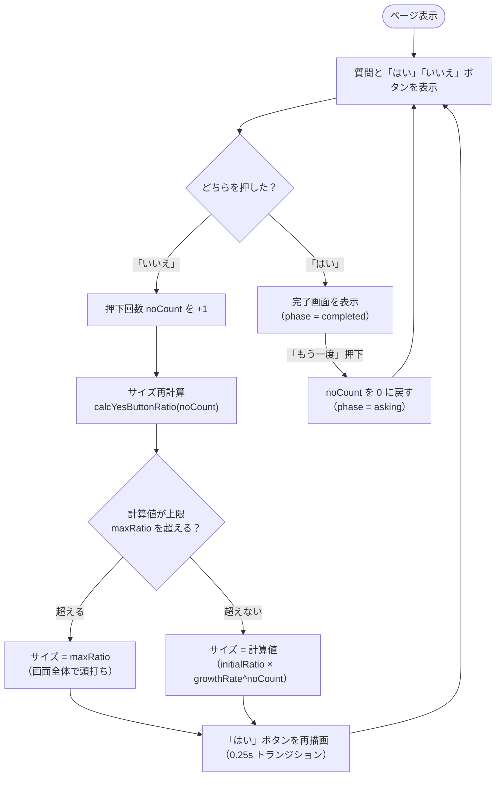

# 処理フロー図（ボタン押下時の流れ）

## この図の意図

このアプリの中核は「**いいえ押下 → 回数カウント → サイズ再計算 → 再描画**」の
ループが回り続け、途中で上限判定が挟まることです。コードでは
`useNoCount`（カウント）と `calcYesButtonRatio`（再計算）に分かれているため、
**全体がひとつのループである**ことは実装からは読み取りにくく、図で示します。

「はい」押下による完了分岐と、「もう一度」による初期化も含め、
ユーザー操作を起点にした処理の流れ全体を 1 枚で追えるようにしています。

## フロー図

## 図と実装の対応

| 図の要素                         | 実装                                                                               |
| -------------------------------- | ---------------------------------------------------------------------------------- |
| 押下回数 noCount を +1           | `src/hooks/useNoCount.ts` の `countNo`                                             |
| サイズ再計算・上限判定           | `src/lib/yesButtonSize.ts` の `calcYesButtonRatio`（上限判定は `Math.min` で内包） |
| 「はい」ボタンを再描画           | `src/components/YesNoButtons.tsx`（CSS カスタムプロパティ `--yes-ratio` 経由）     |
| 完了画面・もう一度               | `src/App.tsx` の `phase` / `src/components/CompleteScreen.tsx`                     |
| 係数（初期サイズ・拡大率・上限） | `src/lib/config.ts`（環境変数で差し替え可能）                                      |

## 補足（図に描いていないこと）

- 煽り文言の表示（#10 で決定、#22 で実装予定）はこのループの「再描画」に
  乗る導出値のため、実装後もフローの形は変わらない
- 状態（asking / completed）の観点は [state.md](state.md)（#13）で扱う
