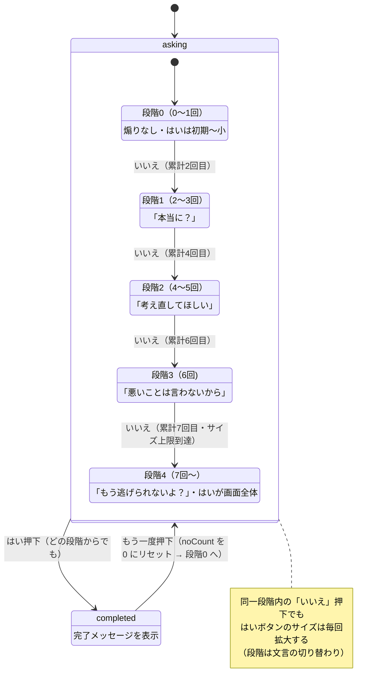

# 状態遷移図（画面の状態機械）

## この図の意図

このアプリの画面は「質問中（asking）」と「完了（completed）」の 2 状態ですが、
質問中の内部では「いいえ」の押下回数に応じて**圧の段階**（はいボタンのサイズ＋
煽り文言）がエスカレートしていきます。この「大きな 2 状態」と「内部の段階」の
二層構造を 1 枚で伝えるために状態遷移図にしました。

段階のしきい値と文言は #10 の決定に基づきます（実装は #22）。

## 状態遷移図

## 図と実装の対応（重要な注記）

- トップレベルの `asking` / `completed` は、実装でもそのまま
  `src/App.tsx` の `phase`（ユニオン型 `'asking' | 'completed'`）に対応します。
- **内部の「段階0〜4」は、実装では独立した state 変数ではありません。**
  押下回数 `noCount`（`src/hooks/useNoCount.ts`）からの**導出値**として
  はいボタンのサイズ（`calcYesButtonRatio`）と煽り文言（#22 で実装予定）が決まります。
  つまりこの図は「UX 上の状態機械」であり、実装は「単一のカウンタ＋導出」で
  同じ振る舞いを実現しています。
- 「はい」はどの段階からでも押せて、常に `completed` へ遷移します
  （段階が進むと「はい」が大きくなるため、物理的に押しやすくなっていく、が
  このアプリの仕掛けです）。

## 図に描いていないこと

- サイズの具体的な計算式・上限判定は [flow.md](flow.md)（#12）を参照
- 段階のしきい値・文言は確定値ではなく #22 実装時に設定（環境変数）で
  差し替え可能にする予定（#10 の決定）
